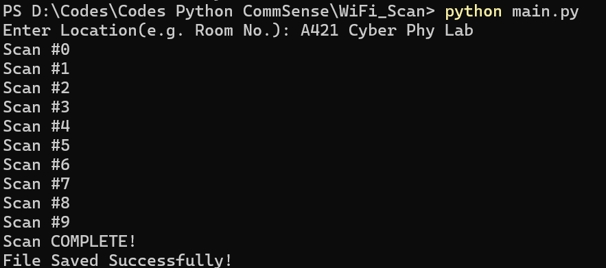

# WiFiRecon
This repository provides a tool for WiFi reconnaissance on Windows Systems, enabling users to collect essential data on nearby Access Points (APs). The collected data can be used to reliably optimize WiFi networks, such as mapping WiFi signal strength within a building.

Tested with python 3.11, 3.12

# Step #1: Getting Started with Python

The following steps cover everything from installing Python to running the script on Windows systems.

## Install Python

1. **Download Python from Microsoft Store (Straightforward way to get python interpreter on MS)**:
   - Search "python" in Microsoft Store and install (python version 3.11 or 3.12) on your system.
2. **(Or) Download Python from official website**: 
   - Go to the official [Python website](https://www.python.org/downloads/) and download the latest version of Python 3.
   - During installation, make sure to check the box that says **"Add Python to PATH"**. This ensures that you can run Python from the command line.

3. **Verify Installation**:
   - Open Command Prompt and type:
     ```bash
     python --version
     ```
   - You should see the installed version of Python.

# Step #2: Running WiFiRecon
- Download the repo, then extract.
  
- Navigate/Open a terminal from the same folder where main.py and its dependencies are located.

1. **Run the Script**:
   ```bash
   python main.py

2. **Required Input**:
- Now you will be asked to provide the location (e.g., Room No, Lab No etc.). Once you provide, hit enter to complete the scan and results to be saved.

Screenshot of a successful run:


# Result Format

The script will generate and save a text file (in the same folder) containing details of nearby WiFi networks, including:

- **Location**: The user-specified location (e.g., "A421 Cyber Phy Lab").
- **Access Point MAC ID**: The unique identifier of each WiFi access point.
- **SSID**: The network name.
- **Center Frequency**: The channel center frequency in MHz.
- **Signal Strength**: The signal strength in dBm.

A sample saved text file is given for reference. The filename will be same as the location provided by you (e.g., "A421 Cyber Phy Lab"). 

Now you can share this saved text file with your admin for efficient network planning.
